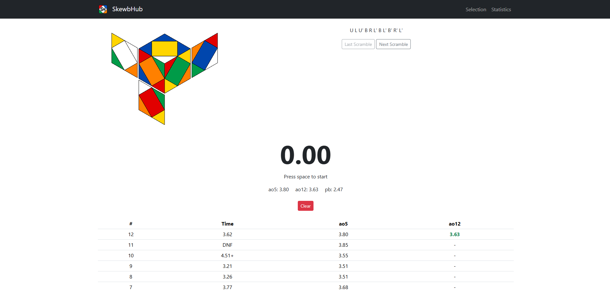
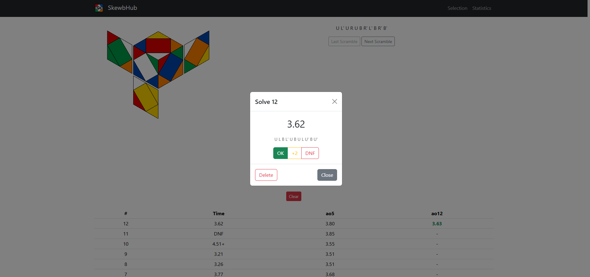

# SkewbHub

A web-based Skewb timer and algorithm trainer to practice cases and track your times.

## Features
- Timer with spacebar control (hold to start on touch screens)
- Official WCA-style scrambles generated with [cubing.js](https://js.cubing.net/cubing/)
- Flat image of the scrambled cube, drawn with SVG
- Session statistics (ao5, ao12, pb) saved in your browser
- Delete individual times or clear the session
- Scramble history with previous and next buttons
- +2 and DNF penalties
- Scramble saved with each solve

## Tech Stack
HTML · CSS · Bootstrap · JavaScript · jQuery

## Live
[fersaezl.github.io/SkewbHub](https://fersaezl.github.io/SkewbHub/)

## Roadmap
- Case training mode
- Export/import times (JSON/CSV)

## Credits
- Scrambles by [cubing.js](https://js.cubing.net/cubing/)
- The layout of the scramble image is inspired by [csTimer](https://cstimer.net/). No csTimer code is used.
